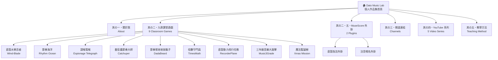
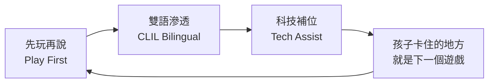

# 🎵 Dato Music Lab — 個人作品集 / Portfolio

> **國小音樂老師 × 教育遊戲開發者**  
> Elementary Music Teacher × EdTech Game Maker

---

## 🏠 網站介紹 / About This Site

這是 **Dato Music Lab** 的個人作品集首頁，展示所有教育遊戲、YouTube 頻道、MuseScore 外掛工具與音樂教學理念。

*This is the personal portfolio of Dato Music Lab — showcasing all classroom games, YouTube content, MuseScore plugins, and music teaching philosophy.*

我是 **Dato**，國小音樂老師。白天上課、放學寫程式——把課堂上「孩子卡住的地方」變成可以在瀏覽器直接玩的教育遊戲：用直笛控制飛機、拍打節奏讓帆船前進、電報解密訓練聽力。

*I'm Dato, an elementary music teacher who codes by night. I turn classroom pain points into browser games — recorder-controlled planes, rhythm-powered sailboats, Morse code ear training.*

---

## 🗺️ 網站結構 / Site Structure

---

## 🎮 九款課堂遊戲 / 9 Classroom Games

| # | 遊戲名稱 | 主題 | 技術亮點 |
|:---:|:---|:---:|:---|
| 第一號 | 🎵 直笛水果忍者 Wind-Blade | 直笛音高 | 麥克風音高辨識 + Autocorrelation |
| 第二號 | 🌊 節奏海洋 Rhythm Ocean | 節奏拍打 | Three.js 3D + 師生互動 |
| 第三號 | 📡 諜報電報 Espionage Telegraph | 聽力長短音 | 摩斯密碼 + Web Audio |
| 第四號 | 🍅 番茄醬節奏大師 Catchuper | 節奏時值 | 長音按壓判定 + FEVER 系統 |
| 第五號 | 🧔 節奏幫爸爸拔鬍子 DadaBeard | 仿奏節奏 | Canvas 動畫 + 節奏錄製回放 |
| 第六號 | ⚽ 倍數守門員 TimesMath | 數學倍數 | MediaPipe Pose + 體感接球 |
| 第七號 | ✈️ 直笛動力飛行任務 RecorderPlane | 直笛音位 | 麥克風 + 五線譜視覺化 |
| 第八號 | 🗡️ 三年級音樂大進擊 Music3Grade | 期末複習 | RPG 問答 + Web Audio 音效合成 |
| 第九號 | 🎄 魔法聖誕樹 Xmas Mission | 季節限定 | Three.js + MediaPipe 手勢 + Bloom |

---

## 🔧 MuseScore 外掛 / MuseScore Plugins

| 外掛 | 功能 | 語言 |
|:---|:---|:---:|
| [直笛指法外掛](https://github.com/linyubert/musescore-recorder-fingering-plugin) | 自動在樂譜產生英式直笛手指編號 | QML |
| [注音唱名外掛](https://github.com/linyubert/musescore-zhuyin-plugin) | 自動在樂譜產生注音符號唱名（首調） | QML |

---

## 🎓 教學理念 / Teaching Philosophy

**壱 先玩再說 Play First** — 奧福取向：從身體打擊、遊戲與律動出發，孩子先「做到」音樂。  
**弐 雙語滲透 CLIL** — Ta、Ti-ti 的節奏語言配上英語指令，雙語自然發生。  
**参 科技補位 Tech Assist** — 孩子卡住的地方，就是下一個遊戲的規格書。

---

## 📊 數據 / Stats

| 指標 | 數值 |
|:---|:---:|
| YouTube 影片 | 36+ |
| 開源 GitHub Repo | 11 |
| Threads 粉絲 | 1.4K+ |
| 月瀏覽數 | 150K+ |

---

## 🔗 所有連結 / All Links

- 🌐 **作品集首頁** — [linyubert.github.io](https://linyubert.github.io/)
- 📺 **YouTube** — [@datoemusic](https://www.youtube.com/@datoemusic)
- 💬 **Threads** — [@lycbert](https://www.threads.com/@lycbert)
- 💻 **GitHub** — [linyubert](https://github.com/linyubert)
- 📝 **教學筆記部落格** — [dtamusicnote.wordpress.com](https://dtamusicnote.wordpress.com)

---

## 🛠️ 技術 / Built With

- **純 HTML + CSS + JavaScript** — 無框架、無建構工具
- **昭和復古設計風格** — 手工印刷感排版、紙張紋理、錯位印刷特效
- **Google Fonts** — Shippori Mincho、DotGothic16、Zen Maru Gothic

---

*Made with 🎵 by Dato — 音樂と遊びの実験室 ♪*  
*All games & plugins are free for classroom and personal use.*
